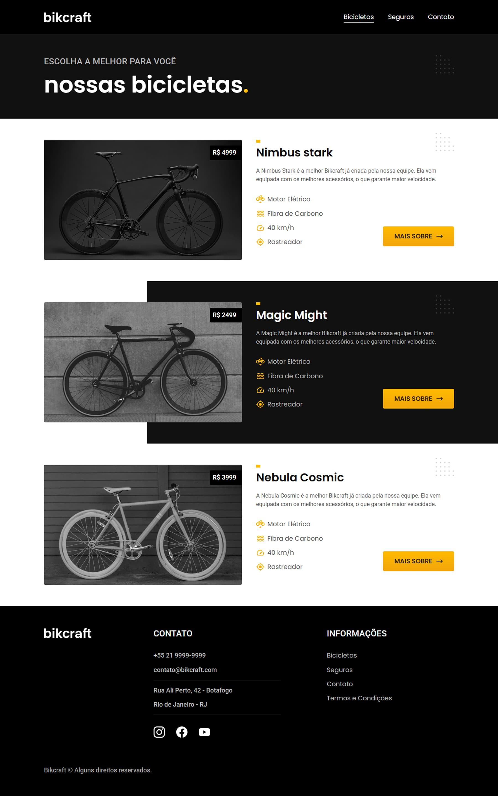
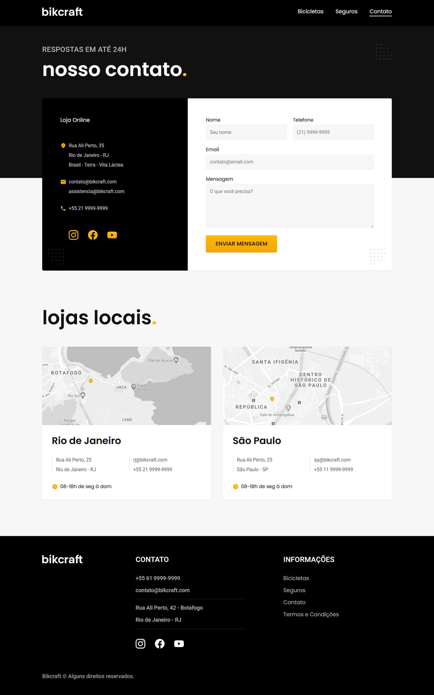
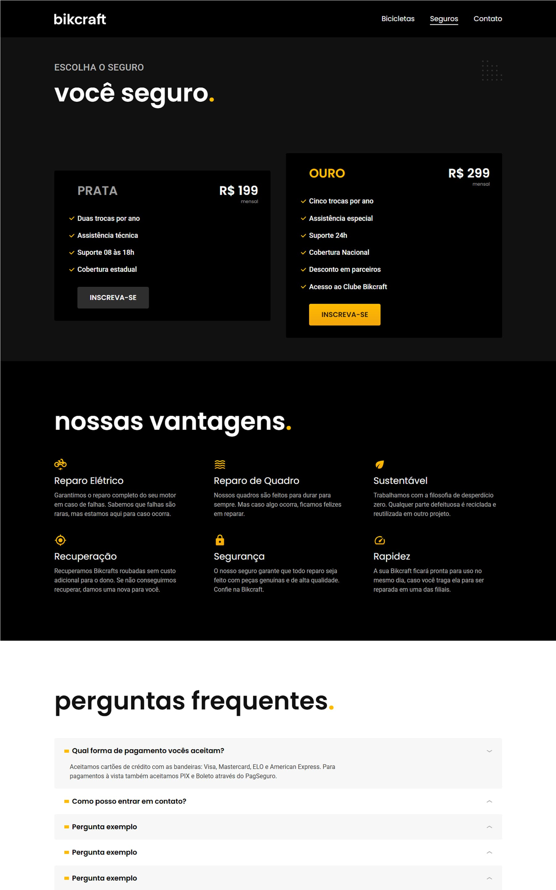

# ORIGAMID - Animais fantásticos

[]()
[]()


> Projeto desenvolvido durante o curso HTML e CSS para iniciantes da Origamid

## 🔗 Links

- **Demo ao vivo:** https://github.com/alvarenga-codes/bikcraft-origamid
- **Curso:** [Origamid - HTML e CSS para iniciantes](https://www.origamid.com)

---

## 📋 Sobre

Projeto completo desenvolvido como exercício final do curso **HTML e CSS para inciantes** da [Origamid](https://origamid.com).

O objetivo era praticar e consolidar conhecimentos de HTML e CSS, criando um site profissional e responsivo do zero.

---

## 🎯 Objetivos de Aprendizado

- ✅ Dominar HTML e CSS
- ✅ Praticar tags, responsividade e estilos
- ✅ Criar layout responsivo completo
- ✅ Trabalhar com site de múltipas páginas

---

## ✨ Características

### Layout & Design

- Design moderno e profissional
- Layout responsivo (mobile, tablet, desktop)
- Grid CSS avançado / Flexbox
- Animações e transições suaves
- Tipografia bem trabalhada

### Funcionalidades

- Navegação entre múltiplas páginas
- Formulários com validação
- Menu responsivo

### Técnicas Aplicadas

- HTML5 semântico
- CSS moderno (variáveis, Grid, Flexbox)
- Acessibilidade (ARIA, semântica)

---

## 🛠️ Tecnologias

- **HTML5** - Estrutura semântica
- **CSS3** - Estilização avançada
- **Git** - Versionamento
- **GitHub Pages** - Deploy

### Conceitos Praticados

- CSS Grid Layout
- CSS Flexbox
- CSS Custom Properties
- Responsive Design

---

## 📁 Estrutura do Projeto

```
projeto/
├── index.html              # Página principal
├── bicicletas.html         # Página de bicicletas
├── contato.html            # Formulário de contato
├── orcamento.html          # Página de orçamento
├── seguros.html            # Página de seguros
├── termos.html             # Página de termos
├── css/
│   ├── style.css          # Estilos principais
│   └── components         # Estilos específicos
├── js/
│   └── script.js          # Scripts
├── img/                   # Imagens
└── README.md
```

## 📸 Screenshots

### Home


### Bicicletas



### Contato



### Seguro



---

## 📚 O que Aprendi

Desenvolvendo este projeto, consolidei conhecimentos em:

- **HTML:** Semântica aplicada na prática
- **CSS:** Estilização modular

---

## 🎓 Certificado

Este projeto faz parte do curso **HTML e CSS para iniciantes** da Origamid.

---

## 👤 Autor

**Rodrigo Alvarenga**  
_Desenvolvedor Frontend & UI Designer_

[](mailto:alvarenga.frontend@gmail.com)
[](https://github.com/alvarenga-codes)

---

## 📖 Sobre a Origamid

A [Origamid](https://origamid.com) é uma plataforma de cursos online focada em design e desenvolvimento web, reconhecida pela qualidade técnica e didática dos seus conteúdos.

---

<div align="center">

**Se este projeto te ajudou, considere dar uma ⭐**

Desenvolvido durante curso Origamid | 2025

</div>
